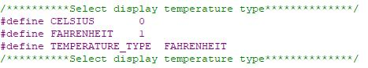
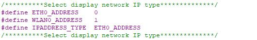

# pp2-mimir


**Mimir** is the Monitoring server for my homelab, hosted on a Raspberry Pi 4.

## 📁 Repo Structure

```text
pp2-mimir/
├── .github/workflows/      # CI for YAML validation
├── backup_logs/            # Oldest logs from update script
├── docker/                 # Docker container(s) for Network Monitoring
├── images/                 # Images for README files
├── logs/                   # Most recent update script logs
├── scripts/                # Auto-Updater script for RPi (can be associated with cronjob)
├── U6143_ssd1306/          # Python, C code, and script for UCTronics display screen
└── README.md               # You're reading it!
```

---

## 🧰 Services

  - **Grafana**: Visualizes metrics and analytics through customizable dashboards.
  - **UniFi Controller**: Manages UniFi network devices and monitors network performance.
  - **Uptime Kuma**: Monitors website and service uptime with alerts on failures.
  - **Ookla Internet SpeedTest**: Measures and logs internet connection speed and latency.
  - **Static-Site Generator (NGinx)**: Serves pre-built static websites via a lightweight web server.

---

## 🖥️ Installing U6143_ssd1306 Display

- Preparation

  - Install GIT (app used to download this repo onto your device)
  ```bash
  sudo apt install git -y
  ```

  - Download repo
  ```bash
  cd
  git clone https://github.com/OnyxJeff/pp2-mimir.git
  ```

  - Launch Raspi-Config
  ```bash
  sudo raspi-config
  ```
  Choose Interface Options Enable i2c

- Run setup_display_service.sh script
```bash
cd ~/pp2-mimir/U6143_ssd1306
chmod +x setup_display_service.sh
sudo ./setup_display_service.sh
```

- Custom display temperature type
  - Open the U6143_ssd1306/C/ssd1306_i2c.h file. You can modify the value of the TEMPERATURE_TYPE variable to change the type of temperature displayed. (The default is Fahrenheit)
  

- Custom display IPADDRESS_TYPE type
  - Open the U6143_ssd1306/C/ssd1306_i2c.h file. You can modify the value of the IPADDRESS_TYPE variable to change the type of IP displayed. (The default is ETH0)
  

- Custom display information
  - Open the U6143_ssd1306/C/ssd1306_i2c.h file. You can modify the value of the IP_SWITCH variable to determine whether to display the IP address or custom information. (The custom IP address is displayed by default)
  

> [!Note]
> I did rewrite the initial install script to be more repo friendly.

---

## ⚠️ Updating the OS

- Update and Upgrade the System via script:
```bash
cd ~/pp2-mimir/scripts
chmod +x apt-get-autoupdater.sh
sudo ./apt-get-autoupdater.sh
```

- Start CronJob (optional but recommended if doing headless/always on installation)
```bash
sudo crontab -e
```

  - add the following to the bottom of the document:
  ```bash
  # OS-Auto-Updater
    00 01 * * 0 bash $HOME/pp2-mimir/scripts/apt-get-autoupdater.sh
      # execute automatic update script and log every sunday at 01:00 am
    50 00 1 * * /bin/bash -c 'cp $HOME/pp2-mimir/logs/apt-get-autoupdater.log $HOME/pp2-mimir/backup_logs/apt-get-autoupdater-$(date +\%Y\%m\%d).log'
      # saves monthly version of "apt-get-autoupdater.log" on the 1st of every month at 00:50 am
    51 00 1 * * rm -f $HOME/pp2-mimir/logs/apt-get-autoupdater.log
      # deletes old weekly log on the 1st of every month at 00:51 am
  ```

---

## 🌐 Installing Speedtest-CLI

- Run the following command to install gnupg1, apt-transport-https, dirmngr and lsb-release to your Raspberry Pi.
```bash
sudo apt install apt-transport-https gnupg1 dirmngr lsb-release
```
  - ```apt-transport-https``` package is used to add support for the https protocol to the apt package manager. Without it apt will throw errors when connecting to Ookla’s package repository.

  - ```gnupg1``` is used for secure communication between your Raspberry Pi and the Speedtest.net servers.

  - ```dirmngr``` is utilized for handling the addition of the package repository to your Raspberry Pi’s sources list.

  - ```lsb-release``` is to grab the operating systems release name.

- With the packages we need installed we can now add the GPG key for Ookla’s Speedtest repository to the keychain.

  We need this keychain to be able to download the speedtest command line interface to our Raspberry Pi.
```bash
curl -L https://packagecloud.io/ookla/speedtest-cli/gpgkey | gpg --dearmor | sudo tee /usr/share/keyrings/speedtestcli-archive-keyring.gpg >/dev/null
```

- Next we need to add the Ookla repository to our sources list.
  
  Without adding the repository we won’t be able to install the Speedtest CLI to our Raspberry Pi.
  
  You can add this repository by running the following command.
```bash
echo "deb [signed-by=/usr/share/keyrings/speedtestcli-archive-keyring.gpg] https://packagecloud.io/ookla/speedtest-cli/debian/ $(lsb_release -cs) main" | sudo tee  /etc/apt/sources.list.d/speedtest.list
```
  Within this command, you will notice we use “$(lsb_release -cs)“. This bit of text allows us to insert the release name for our installation of Raspberry Pi OS directly into the command.

- As we added a new package repository we need to update our package list.

  Updating the package list is as simple as running the following command.
```bash
sudo apt update
```

- Finally, we can install the official Speedtest CLI to our Raspberry Pi from Ookla.

  Use the following command to install the package to your device.
```bash
sudo apt install speedtest
```

- We can now test that we have installed the speedtest software to your Raspberry Pi.

  Let us run the following command to start up the speedtest.
```bash
speedtest
```

---

## 📦 Installing Docker Compose

- Install Docker
```bash
cd
curl -fsSL https://get.docker.com -o get-docker.sh
sudo sh get-docker.sh
```

- Add User to Docker Group
```bash
sudo usermod -aG docker $USER
```

> [!IMPORTANT]
> After running this command you will need to log out and log back in (or I recommend just rebooting) for the changes to take effect.

- Install Docker Compose:
```bash
sudo apt install docker-compose-plugin
```

- Verify Installation:
```bash
docker run hello-world
docker compose version
```

---

### 📝 Installing your first container(s)

- Installing Monitoring Stack (via script)
```bash
cd ~/pp2-mimir/scripts
chmod +x docker-up-all.sh
./docker-up-all.sh
```

---

## Acknowledgements

This project uses or is inspired by the following repositories:

- [U6143_ssd1306](https://github.com/UCTRONICS/U6143_ssd1306) – Provides the C display code used in the systemd service setup.
- [UniFi-RPi](https://github.com/ryansch/docker-unifi-rpi) - UniFi Controller for Raspberry Pi.
- [Internet Monitoring](https://github.com/tb942/internet-monitoring) – Used for Docker-based Prometheus monitoring and metrics collection as well as Ookla Speedtest.
- [Uptime-Kuma](https://github.com/louislam/uptime-kuma) - Uptime Kuma visual server monitoring.

---

📬 Maintained By
Jeff M. • [@OnyxJeff](https://www.github.com/onyxjeff)